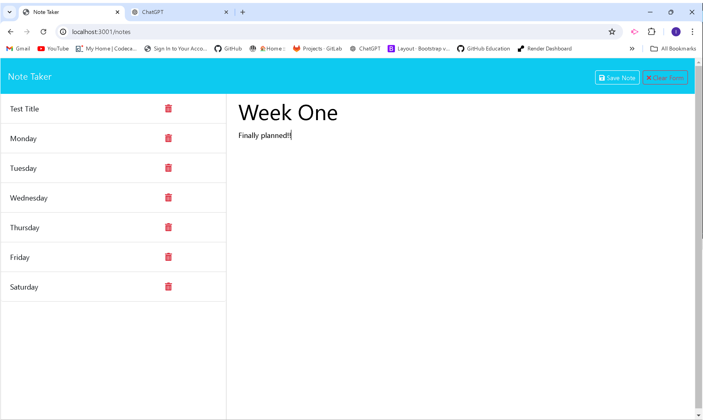

# Digital-Notebook

This is a user-friendly application designed to help users organize their thoughts and also keep track of notes, ideas and tasks efficiently. With features like writing, saving and deleting functions, it is the perfect application for students, professionals and anyone who needs to keep their thoughts in order.

## Installation
To install enter 'npm install'  and then  'node server.js' to run.

## Usage
Once the application is started, click the "Get started" button to open your note page. Then enter the "Note Title" and "Note text" and click the "Save Note" button to save your notes. You can retrieve your notes back by clicking on it. And you can also delete your note by clicking the "delete icon beside each saved note. You can also add as many notes as possible with the "New Note" button at the top right corner.

## License
This project is licensed under the MIT license.

## Questions
For more questions, please open an issue on my github: [ifylee](https://github.com/ifylee)

You can also contact me directly at:  [ifyekezie@yahoo.co.uk](mailto:ifyekezie@yahoo.co.uk)

You are just a click away from a world of keeping tracks of your thoughts and tasks digitally:
https://github.com/Ifylee/digital-notebook

## Live at: 
https://digital-notebook.onrender.com

